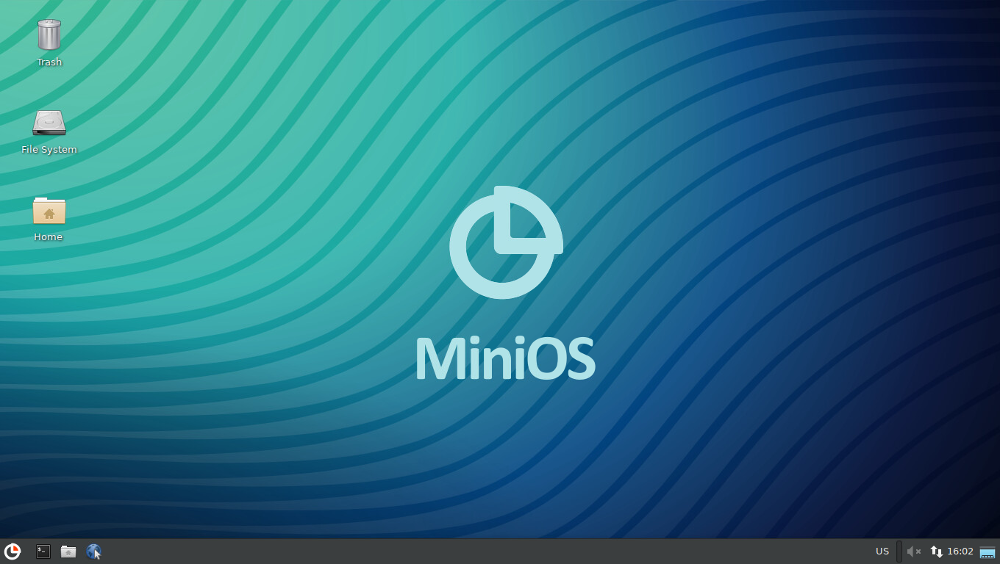

### MiniOS APT Repository
[](https://minios.dev)


```
sudo apt install -y apt-transport-https
curl https://minios-linux.github.io/debian/minios-linux.asc | sudo gpg --dearmor > /etc/apt/trusted.gpg.d/minios-linux.gpg
sudo echo "deb https://minios-linux.github.io/debian bullseye main contrib non-free" >/etc/apt/sources.list.d/minios-linux.list
```
